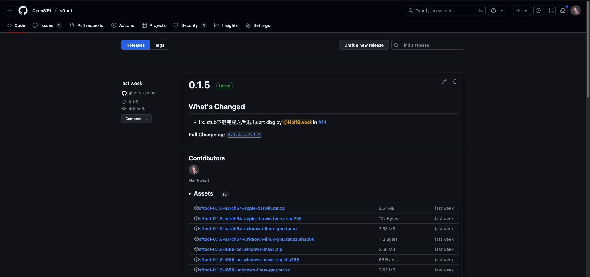
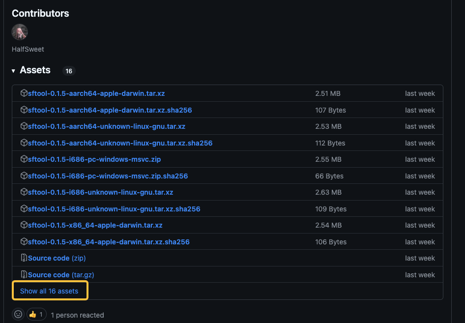
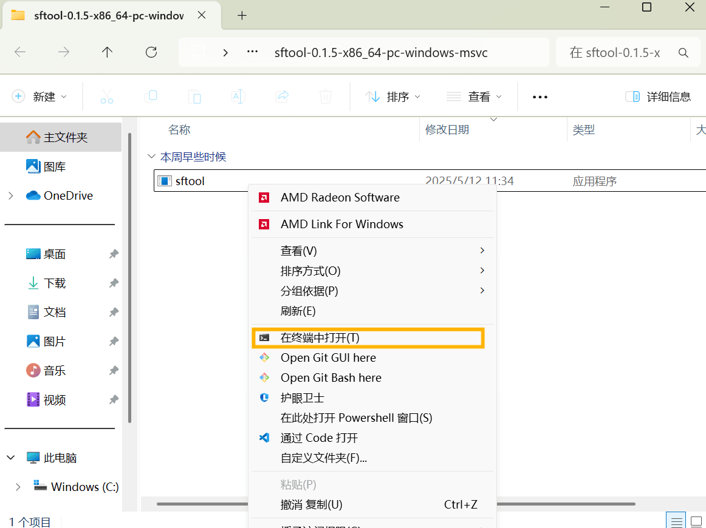

sftool 是一个用于SF32系列SoC芯片的下载工具，在后续的使用中，我们将学习如何下载sftoool及使用sftool给SF32芯片烧录程序。

## 下载sftool

sftool 是一个开源软件，可以在[GitHub](https://github.com/OpenSiFli/sftool) 上找到它的源码。不过我们现在并不需要关心源码，只需要下载编译好的二进制文件即可。

我们可以在[Release](https://github.com/OpenSiFli/sftool/releases) 页面中找到最新版本的sftool，其中最靠前的版本并且有着`Latest`绿色标签的就是最新版本。例如我现在的最新版本上`0.1.5`，看起来是这样的：



接下来我们需要选择合适的版本。我们需要根据自己的操作系统和CPU架构来选择合适的版本。sftool支持Linux、Windows和MacOS等操作系统，支持x86_64和aarch64等CPU架构。例如我们是`Windows 64bit`操作系统，我们就应该选择` sftool-0.1.5-x86_64-pc-windows-msvc.zip`这个版本，同样的，如果是`Windows 32bit`的版本，我们就应该选择`sftool-0.1.5-i686-pc-windows-msvc.zip`这个文件镜像下载。特别的，如果您找不到您系统的文件，那可能需要点击一下`Show all assets`按钮。



下载完成之后，我们需要解压这个文件，解压之后我们会得到一个**命令行**工具，在windows上它的后缀是`.exe`（sftool.exe），在Linux和MacOS上没有后缀（sftool）。需要注意的是，windows的资源管理器可能会忽略文件的后缀名，因此看起来可能也是`sftool`。

::: tip

对于中国大陆地区用户，可以无法访问`Github`，因此可使用国内镜像加速链接。例如原链接为：`https://github.com/OpenSiFli/sftool/releases/download/0.1.5/sftool-0.1.5-x86_64-pc-windows-msvc.zip`，那么我们就将`github.com`替换为`downloads.sifli.com/github_assets`，变成`https://downloads.sifli.com/github_assets/OpenSiFli/sftool/releases/download/0.1.5/sftool-0.1.5-x86_64-pc-windows-msvc.zip`，就可以加速下载了。

:::

## sftool 命令格式及使用方法

sftool是一个命令行工具，它有一套自己的命令格式，一般的命令规则如下：

```bash
sftool [选项] [选项值] [命令] [命令选项]
```

### 全局选项

- `-c, --chip <CHIP>`: 目标芯片类型 (目前支持SF32LB52)
- `-m, --memory <MEMORY>`: 存储类型 [nor, nand, sd] (默认: nor)
- `-p, --port <PORT>`: 串行端口设备路径
- `-b, --baud <BAUD>`: 闪存/读取时使用的串口波特率 (默认: 1000000)
- `--before <OPERATION>`: 连接芯片前的操作 [no_reset, soft_reset] (默认: no_reset)
- `--after <OPERATION>`: 工具完成后的操作 [no_reset, soft_reset] (默认: soft_reset)
- `--connect-attempts <ATTEMPTS>`: 连接尝试次数，负数或0表示无限次 (默认: 7)
- `--compat` : 兼容模式，如果经常出现超时错误或下载后校验失败，则应打开此选项。

### 写入闪存命令

```bash
# Linux/Mac
sftool -c SF32LB52 -p /dev/ttyUSB0 write_flash [选项] <文件@地址>...
# Windows
sftool -c SF32LB52 -p COM9 write_flash [选项] <文件@地址>...
```

#### 写入闪存选项

- `--verify`: 验证刚写入的闪存数据
- `-u, --no-compress`: 传输期间禁用数据压缩
- `-e, --erase-all`: 在编程前擦除所有闪存区域（不仅仅是写入区域）
- `<文件@地址>`: 二进制文件及其目标地址，如果文件格式包含地址信息，@地址部分是可选的

### 示例

Linux/Mac:

```bash
# 写入单个文件到闪存
sftool -c SF32LB52 -p /dev/ttyUSB0 write_flash app.bin@0x12020000

# 写入多个文件到不同地址
sftool -c SF32LB52 -p /dev/ttyUSB0 write_flash bootloader.bin@0x12010000 app.bin@0x12020000 ftab.bin@0x12000000

# 写入并验证
sftool -c SF32LB52 -p /dev/ttyUSB0 write_flash --verify app.bin@0x12020000

# 写入前擦除所有闪存
sftool -c SF32LB52 -p /dev/ttyUSB0 write_flash -e app.bin@0x12020000
```

Windows:

```bash
# 写入多个文件到不同地址
sftool -c SF32LB52 -p COM10 write_flash bootloader.bin@0x12010000 app.bin@0x12020000 ftab.bin@0x12000000
# 其它同上
```
## 命令行工具的使用

本章节针对Windows系统用户，其他系统的用户想必已经拥有了丰富的命令行工具使用经验，因此不再赘述。有经验的Windows用户也可以跳过本章节。

### 一些科普

假设你是一个对命令行工具完全不了解的用户，我们可能需要先进行一些科普，如果你已经知道了命令行工具的原理，也可以跳过本章节。

#### 1. Terminal和Shell是什么？

##### Terminal（终端）

终端的定义是一个用于输入命令和查看结果的用户界面，类似于一个"对话窗口"。做一个比喻就像你使用浏览器访问网页一样，终端是你与操作系统"对话"的工具。

在Windows上常见的终端有：

- 传统：命令提示符（CMD）、PowerShell
- 现代：Windows Terminal（微软官方推荐，支持多标签、主题美化）

特别的，我们强烈推荐windows10及以上的用户使用Windows Terminal，你可以在Microsoft Store中搜索`Windows Terminal`进行安装。或者参考微软官方文档：<https://learn.microsoft.com/zh-cn/windows/terminal/install>

## Shell

Shell的定义是运行在终端背后的命令解释器，负责理解你的命令并执行操作。

我们常见Shell类型有：

- CMD Shell：Windows经典命令行环境（功能较简单）
- PowerShell：微软开发的强大Shell，支持脚本和复杂操作
- Bash：Linux/macOS的默认Shell（Windows下最常见的就是`git bash`）

需要注意的是，CMD Shell和CMD是完全不同的，但是在CMD中默认运行的Shell就是CMD Shell。PowerShell同理。

#### 2. 如何打开终端

##### 通过开始菜单

按 Win键 或点击左下角Windows图标，输入以下名称之一搜索：

- `cmd`
- `powershell`

如果没有意外的话，打开之后将会看到一个黑色或者蓝色的窗口，这就是命令行工具了，接下来我们一切操作都在此进行

##### 通过“运行”窗口

1. 按下 `Win + R` 组合键，打开运行窗口
2. 输入以下命令之一，点击确定：

   - `cmd`：打开命令提示符
   - `powershell`：打开PowerShell

如果没有意外的话，打开之后将会看到一个黑色或者蓝色的窗口，这就是命令行工具了，接下来我们一切操作都在此进行

##### 通过Windows Terminal

在较高版本的Windows 10或者11中，已经预装了Windows Terminal并且可以在直接切换到某个目录。我们可以在目标目录（在目前的场景下是下载好之后的sftool.exe所在目录）中，右键点击空白处，选择`在终端中打开`，就可以直接在工作目录打开Windows Terminal并开始使用了。如果没有该选项，尝试按住shift同时右键单击，打开完全的右键菜单，选择`在终端中打开`。如果仍然没有，右键单击任务栏Windows徽标，选择“终端”，此方法需要cd到工作目录再使用。



#### 3. 切换工作目录

在上一章中使用Windows Terminal打开的话，会自动切换工作目录，可以跳过本章节。

如果你是使用CMD或者PowerShell打开的，那么我们需要手动切换工作目录。我们可以使用`cd`命令来切换工作目录，命令格式如下：

```shell
cd <目录>
```

例如我们下载的sftool.exe在`C:\sftool`目录下，我们可以使用以下命令切换到该目录：

::: tabs#shell

@tab cmd

```cmd
cd C:\sftool
```

@tab powershell
```powershell
cd C:\sftool
```

:::

目前来看两者的命令似乎没有差异，但是当目标目录在另一个盘符的时候，命令就有所不同了。例如我们现在的sftool在`D:\sftool`目录下，我们可以使用以下命令切换到该目录：
::: tabs#shell
@tab cmd
```cmd
cd /d D:\sftool
```

@tab powershell
```powershell
cd D:\sftool
```
:::

可以看得出，CMD需要加上`/d`参数，而PowerShell则不需要。

另外还有一点需要注意，如果路径中存在空格，那么需要使用`"`将路径括起来，例如：

```shell
cd "C:\My Documents\sftool"
```

#### 4. 调用sftool

切换到sftool.exe所在目录后，我们先尝试获取`sftool`的版本。

```powershell
.\sftool.exe --version
```

当然我们也可以省略掉`.exe`后缀，直接使用`sftool`命令：

```powershell
.\sftool --version
```

如果没有意外的话，应该会看到类似下面的输出：

```shell
sftool 0.1.5
```

如果你看到的是`'sftool' 不是内部或外部命令，也不是可运行的程序`等字样，那么有如下几种可能：

- 你没有切换到sftool.exe所在目录
- 你没有使用`.\`前缀

这两者都很重要，缺一不可。如有其他问题，可以前往<https://bbs.sifli.com/>论坛发帖询问。

## 下载固件

下载固件我们使用`write_flash`命令，命令格式如下：

```shell
sftool write_flash [选项] [选项值]  <固件文件>
```

### 选项

- 参见 [sftool 命令格式及使用方法](#sftool-命令格式及使用方法)

### 固件文件

这个是需要下载到芯片上的固件文件，通常是一个`.bin`文件。要将其用sftool烧录，引用文件的格式为`文件@目标寄存器地址`，例如：

```shell
sftool write_flash [选项][选项值] firmware.bin@0x12000000
```

如果有多个文件需要下载，可以使用空格分隔，例如：

```shell
sftool write_flash [选项][选项值] firmware1.bin@0x12000000 firmware2.bin@0x12100000
```

另外，sftool也支持直接下载`.elf`和`.hex`文件，使用这两种文件格式的时候，可以不需要指定地址，sftool会自动解析文件中的地址信息。例如：

```shell
sftool write_flash [选项][选项值] firmware.elf
```

::: tip
如果路径中存在空格，那么需要使用`"`将路径括起来，例如：

```shell
sftool write_flash [选项][选项值] "C:\My Documents\firmware.bin@0x12000000"
```

:::
